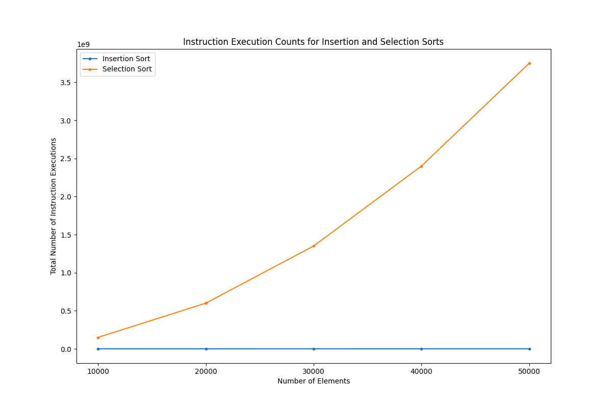
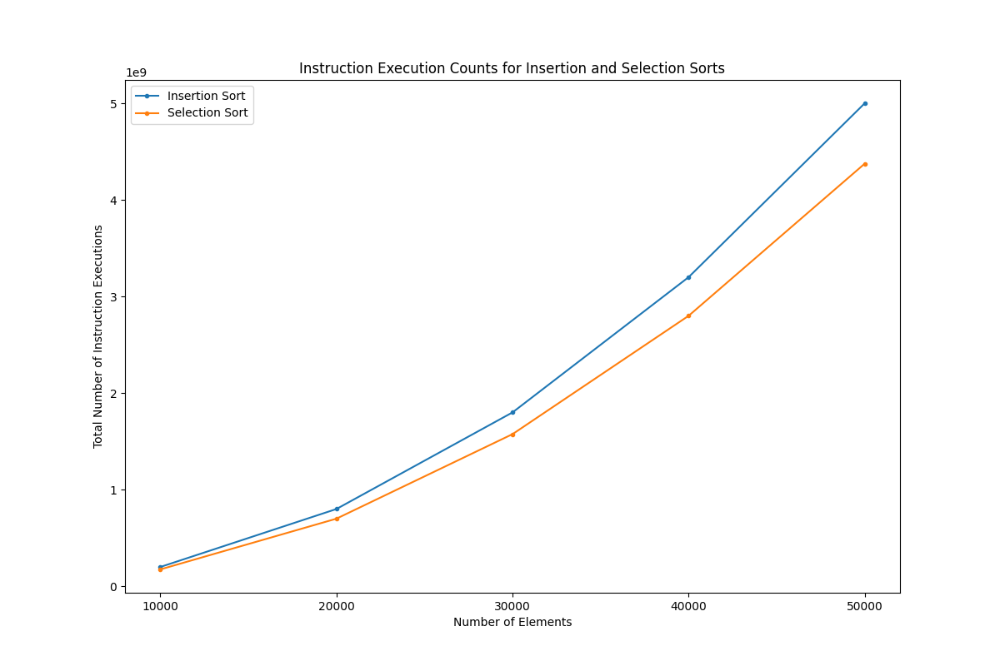
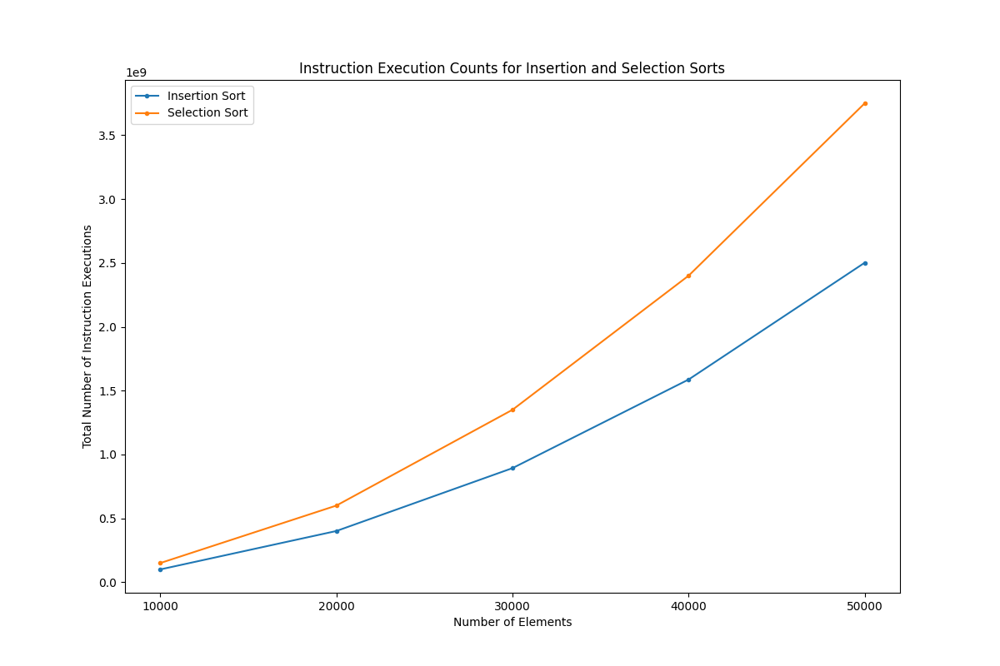

# A Battle of Sorts

The purpose of this project is to explore performance implications of algorithms and their associated input. Sort.py is code for two simple sorting algorthms: insertion and selection sort. Both algorithms are run by Auto_Processing.py, which automatically runs Sort.py, processes instruction counts for each sorting algorithm, and creates graphs pertaining the instruction counts and list size. These programs support initially increasing, decreasing, and random order of integers in the list, and a graph may be constructed for each of them. 

---

## Performance Analysis for Each Orientation Type

### Initially Increasing Order

Since each element in the array is in increasing order, there is never an element that is less than the one before it. As a result, there is no need for the insertion sort to move any element and run through their preceding elements. The insertion sort simply runs through each element of the array one by one, and so the number of instruction executions and the number of elements are related linearly. On the other hand, selection sort always runs through the subsequent elements for each individual element regardless of whether it is already in the right place, so it takes more steps than insertion sort does. 

Moreover, selection sort basically runs through entire portions of the array as many times as there are elements in the array, and said portions are closer to be as large as the array when the selection sort first starts sorting. Because of this kind of repeated run-through of the same array, the number of steps it takes to complete a selection sort increases exponentially as the number of elements increase, hence the curving pattern on the graph.

### Initially Decreasing Order

Both the insertion and selection sorts run their while loops. Unlike in the initially increasing case, the insertion sort here must run through every preceding element for each element in the array. As a result, it, like selection sort, basically runs through entire portions of the array as many times as there are elements in the array, which is a huge contrast (because of the large array size) to just running through the array only once in the initially increasing case.

### Initially Random Order

In the initially increasing case, the insertion sort never checks the preceding elements since they’re always less than the current element. 

In the initially decreasing case, the insertion sort always checks the preceding elements since they’re always greater than the current element. 

Here, however, each element may or may not be greater or less than any number of preceding elements. Insertion sort will often stop before reaching the final element to check by finding an element less than or equal to the current one. Thus, the insertion sort does not always run through all preceding elements before moving on to the next element. 

On the other hand, selection sort always runs through all subsequent elements of each individual element regardless of whether it is already in the right place, so it tends to run through more elements than insertion sort does in the initially random case.
